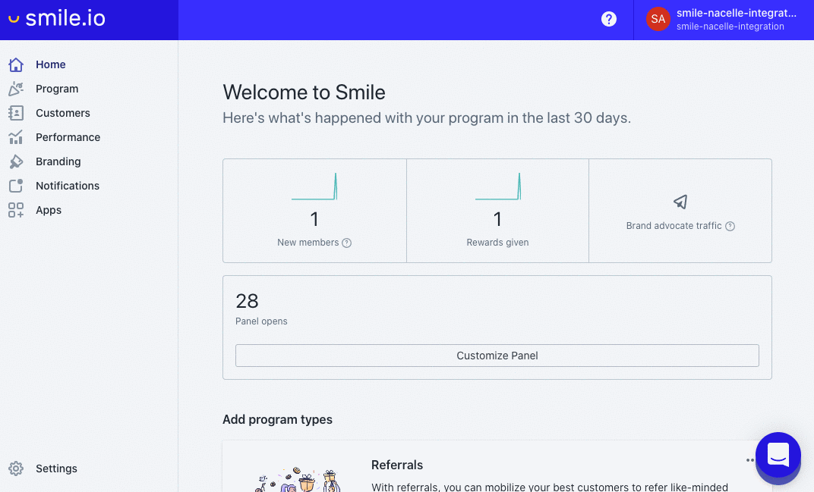

# [DEPRECATED]

This package is deprecated. To integrate a third party script with your Nuxt project, follow our docs here: https://docs.getnacelle.com/nuxt/external-scripts.html
# Nacelle Smile.io Nuxt Module

Easily integrate [Smile.io](https://smile.io/) loyalty rewards program into your [Nacelle](https://getnacelle.com/) Nuxt project.

## Requirements

- A Nacelle project set up locally. See https://docs.getnacelle.com for getting started.
- A Smile.io account and installed on your Shopify store.

## Setup

### Add Module to Nacelle

Once you hace Nacelle and Smile set up you can install this module in your project from `npm`:

```
npm install @nacelle/nacelle-smile.io-nuxt-module --save
```

After the package has installed, open `nuxt.config.js`. Under `modules` add `@nacelle/nacelle-smile.io-nuxt-module` to the array:

```js
modules: [
  // other modules,
  '@nacelle/nacelle-smile.io-nuxt-module',
]
```

Next, the `SMILE_API_KEY` (Public) and `SMILE_SECRET` (Private) to the project's `.env` file.

[](./smile-creds.gif)
 
We'll pass the environment variables to the module by adding a new `smile` object with  `key` and `secret` properties to the `nacelle` block of `nuxt.config.js`:

```js
nacelle: [
  // other nacelle config,
  smile: {
    key: process.env.SMILE_API_KEY,
    secret: process.env.SMILE_SECRET,
  },
]
```

To make the Smile widget visible in your store, open up `layouts/default.vue` and paste `<smile-widget />` just before the closing `div` in the template:

```html
<div class="app nacelle">
  <!-- <other-elements /> -->
  <smile-widget />
</div>
```

### Shopify Setup

If using the [Shopify Hosted Solution](https://docs.getnacelle.com/integrations/shopify-accounts.html#shopify-hosted-solution) for Accounts, then follow the additional steps below.

Otherwise, if using the [Integrated Account Solution](https://docs.getnacelle.com/integrations/shopify-accounts.html#integrated-account-solution) or any other method, you can just pass the customer object into the `SmileWidget` component as props like this:

```html
<smile-widget :customer="customer" />
```

To complete the integration a liquid snippet needs to be added to your Shopify theme.

Open your Shopify theme code editor under "Actions > Edit Code". Under "Snippets" click "Add new snippet". Name the snippet `smile-init.liquid`, paste the following code, and save:

```

  
  
  

<script>
  if (window.Cookies) {
    var smileUser = {
      customerId: {{ smile_customer_id | json }},
      digest: {{ smile_digest | json }}
    };

    Cookies.set('nacelle_smile_user', JSON.stringify(smileUser), {expires: 30});
  }
</script>


```

Open `theme.liquid` and and before the closing `body` tag paste ``. Your Shopify account pages will now set the correct smile data to be used in your Nacelle store.
